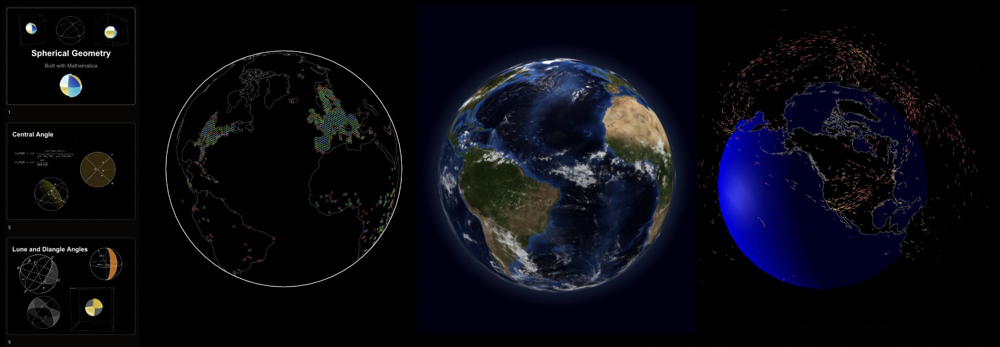
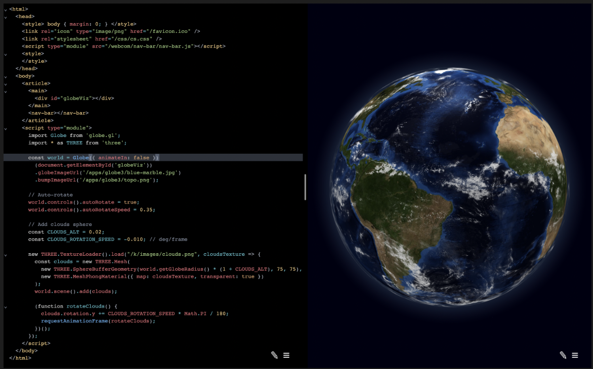
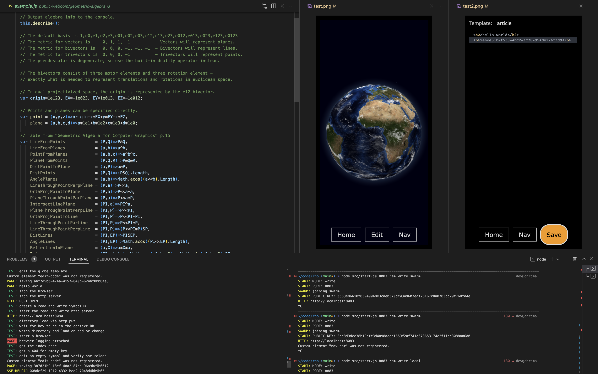

# Rho 
> Publish Geospatial Media to the Planet

### A Peet-to-Peer Network for Geospatial Media
1. Write software in the context of a Geospatial Media
1. End to End encrypted video and data
1. Integrated Machine Learning and AI like code assist
2. Move computation & data from the Cloud to Bookshelf
1. Publish and distribute your work worldwide in seconds
1. Punches through firewalls and torrents data by key

# Co-Projects
Check out this soil data project:
https://github.com/mejia-code/soil_data_research


### Overcome Legacy system limitations
1. Centralized certification
1. High cost content providers
1. Centralized data storage
1. Data transfer costs


> Live in browser edit example

## Geospatial Web Dev School & P2P mesh
1. Directed graph of components via `meta` keys
1. Many examples with code to learn from
1. End to End UX Testing
1. ML code assistant
1. Web Crawler
1. hackable default UI
1. no trackers
1. no PII

# Start
To install the program
```sh
# To create a writeable node
npx chromatic-systems/rho 8080 ram write swarm
# Note the `Public Key` printed to the console

# To create a read only node
npx chromatic-systems/rho 8081 ram read swarm <64 byte key from a writer>

# Open a browser to http://localhost:8080
# Or whatever port you chose above
```

### Options
```
npx chromatic-systems/rho <port> [ ram | disk ] [ write | read ] [ swarm | local ] <public key>
```
## Optional tunnel on the open web
1. optionally tunnel over cloudflare to connect the old world to the peer-to-peer world
```
cloudflared tunnel --name dev --hostname dev.yourdomain.io
```


# Install Local for Development
```sh
npm install
```
# Test
```sh
npm test
```
test with debugger
```sh
npm run test:i
```


> Dev log update

# Milestone 1: Peer-to-peer mesh
- npx to p2p mesh `working!`
- web editor `working!`
- p2p keystore `working!`

# Milestone 2: Codex integration
- codex `basic library working, need integration`
- navigation `basic page enabled, need user interface`
- self hosting shadow chrome tab `host is working see browser.js, need to replace browser that starts from start.test.js`

# Milestone 3: Full Text Search
- full text search 
see https://github.com/nextapps-de/flexsearch
- page capture and cache assets
see playwright 

# Why are you building this?
## The New Learning Economy: It’s Time To Build in Education
- https://a16z.com/2022/09/16/the-new-learning-economy-its-time-to-build-in-education/

As we enter the third school year of the Covid era, a disturbing new normal is settling over the country. Students continue to be chronically absent; nearly 50,000 Los Angeles public school students failed to show up on the first day of school. Nine-year-olds’ math and reading levels have dropped to 20-year lows, and the dip in reading scores is the steepest decline in more than 30 years. Teacher vacancies are reaching crisis levels. Schools are even resorting to bringing back retirees and loosening basic teaching requirements to fill gaps. 

Why is this so important? Education is a $1.8 trillion-dollar industry in the U.S. More importantly, our education system shapes who our future leaders and builders will be—more than 1 in 5 people in the U.S. are current K–12 and college students.

The pandemic catalyzed big shifts at all levels of education, in some cases upending what were previously slow, decade-long trends. Technology adoption in classrooms accelerated; parents pulled their kids out of public schools by the millions after seeing firsthand the inadequacies of our current education system; teens became study influencers on TikTok and made learning cool again (aka #studytok); and the government stepped in with hundreds of billions of dollars for public education. These shifts are driving an expansion of EdTech beyond lecture halls and classrooms, beyond K–12 schools and colleges, to lifelong learning and what we call the Learning Economy. 

Naysayers may note that education venture funding returns have trailed the returns generated by other markets, or that only three companies (Coursera, Duolingo, and Udemy) have gone public in the last year. But we believe that the Learning Economy is a much broader sector—and one that spans a longer timeframe—than most people think. The Learning Economy doesn’t just refer to academic tools and student/teacher-facing technologies. Rather, it encompasses all the different ways we develop as human beings, be it picking up a hobby or learning to be a better boss, parent, or friend.

## To read more
see [strategy](./strategy.md)

# Roadmap
1. load fulltext from hyperbee stream
1. code assist with OpenAI Codex `started`
1. handle etags / caching `started and testing`
1. add a lock `public key sig`
1. add `module loader esm` backend then cache to hyperbee
1. accessible multi language, alt text, tap to use, audio-alts, tab targets
1. MMO Live coding

# Architecture
1. `http` server on top of `hyperbee`
1. share public key to replicate
1. add a public route and now you have a CDN
1. `symbols` are stored as `key[ meta, data, ... ]` in a `hyperbee`
1. `symbols` store a few keys with different `types`
1. These are `meta` `icon` `data` `lock`
1. These types are stored as `sub` keyspace in `hyperbee`
1. a http server proxies requests to the `symbol` keyspace
1. changes live refresh the system
1. watches `/public` and loads into the `symbol` keyspace
1. runs `chromium` browser as the test client
1. all logs are piped togther for devUX
1. `routes` are defined in `http.js`
1. `templates` are optionally applied transforms to `symbols` on a HTTP GET request, the current example is `article` which is a `template` on the `edit` page selector

# Optional Dependencies
1. OpenAi Codex API key https://beta.openai.com/docs/guides/code

# Priorites
1. Tests run first
1. Dont break the build
1. Test the live system
1. Clean up as you go
1. Getting started over perfecting the system

# Cloudflare Tunnel Getting Started
```
cloudflared tunnel list
cloudflared tunnel --name dev --hostname dev.yourdomain.io --hello-world true
cloudflared tunnel list
cloudflared tunnel cleanup dev
cloudflared tunnel delete dev
cloudflared tunnel list
```

# Symbol Templates
1. Article: 
1. Text:
1. HTML:
1. Map: https://deck.gl/
1. Markdown: https://github.com/showdownjs/showdown
1. Canvas: https://developer.mozilla.org/en-US/docs/Web/API/Canvas_API/Tutorial
1. Globe: https://chromatic.systems/h3
1. Tree: https://chromatic.systems/dag
1. Graph: https://chromatic.systems/dag
1. CAD & BIM: https://ifcjs.github.io/info/
1. CSG: https://github.com/gkjohnson/three-bvh-csg
1. Timeline:
1. Table:
1. cryptography: https://github.com/openpgpjs/openpgpjs
1. combinatorics: https://github.com/N8Brooks/combinatorics
1. Mathematica: https://reference.wolfram.com/language/ref/program/wolframscript.html
1. Image:
1. Video:
1. Audio: https://github.com/chaosprint/glicol
1. Code: https://chromatic.systems/e/1
1. Form:
1. List:
1. Grid:
1. Body Track: https://www.tensorflow.org/lite/examples/pose_estimation/overview
1. Paint: https://github.com/CompVis/stable-diffusion
1. Payments: https://github.com/holepunchto/invoices
1. Calendar: 
1. Chat:  
1. Email https://www.mailgun.com/
1. Phone https://www.twilio.com/
1. OCR https://github.com/naptha/tesseract.js
1. Map Directions https://github.com/headwaymaps/headway


# Tooling and Development
## Patch
https://www.npmjs.com/package/patch-package
```sh
# fix a bug in one of your dependencies
vim node_modules/some-package/brokenFile.js

# run patch-package to create a .patch file
npx patch-package @popeindustries/lit-html-server

# commit the patch file to share the fix with your team
git add patches/some-package+3.14.15.patch
git commit -m "fix brokenFile.js in some-package"

  "scripts": {
    "postinstall": "patch-package",

npm i patch-package
```
## Applying patches
Run patch-package without arguments to apply all patches in your project.
