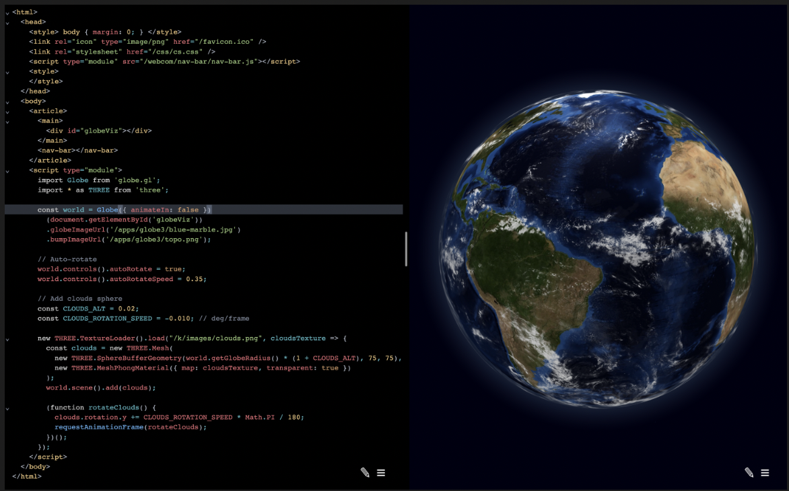

# Rho 
### Computational Media Mesh


> Live in browser edit example


> Dev log update

# Milestone 1: Peer-to-peer mesh
- npx to p2p mesh `working!`
- web editor `working!`
- p2p keystore `working!`

# Milestone 2: Codex integration
- codex `basic library working, need integration`
- navigation `basic page enabled, need user interface`
- self hosting shadow chrome tab `host is working see browser.js, need to replace browser that starts from start.test.js`

# Milestone 3: Full Text Search
- full text search 
see https://github.com/nextapps-de/flexsearch
- page capture and cache assets
see playwright 

# Start
To install the program
```sh
npx chromatic-systems/rho 8080 ram write swarm
npx chromatic-systems/rho 8081 ram read swarm <64 byte keys>
```
```
npx chromatic-systems/rho <port> [ ram | disk ] [ write | read ] [ swarm | local ] <public key>
```

# Open the browser
1. http://localhost:8080

# Optional tunnel on the open web
1. optionally tunnel over cloudflare to connect the old world to the peer-to-peer world
```
cloudflared tunnel --name dev --hostname dev.yourdomain.io
```

# Test
```sh
npm test
```

To run with the debugger
```sh
npm run test:i
```

Web Dev + P2P mesh
1. moves the server from the cloud to the bookshelf
1. Directed graph of components via `meta` keys
1. Many examples with code to learn from
1. Integrated browser Testing
1. Integrated code assistant
1. Integrated Web Crawler
1. hackable default UI
1. Core `node:http`
1. no trackers
1. no PII

# Roadmap
1. fix `THREE.SphereBufferGeometry has been renamed to THREE.SphereGeometry.` warning
1. load fulltext from hyperbee stream
1. code assist with OpenAI Codex `started`
1. handle etags / caching `started and testing`
1. add a lock `public key sig`
1. add api/esm backend then cache to hyperbee
1. accessible multi language, alt text, tap to use, audio-alts, tab targets
1. MMO Live coding
1. fuzz testing

# Architecture
1. `http` server on top of `hyperbee`
1. share public key to replicate
1. add a public route and now you have a CDN
1. `symbols` are stored as `key[ meta, data, ... ]` in a `hyperbee`
1. `symbols` store a few keys with different `types`
1. These are `meta` `icon` `data` `lock`
1. These types are stored as `sub` keyspace in `hyperbee`
1. a http server proxies requests to the `symbol` keyspace
1. changes live refresh the system
1. watches `/public` and loads into the `symbol` keyspace
1. runs `chromium` browser as the test client
1. all logs are piped togther for devUX
1. `routes` are defined in `http.js`
1. `templates` are optionally applied transforms to `symbols` on a HTTP GET request, the current example is `article` which is a `template` on the `edit` page selector


# Recently Added
1. add template selector to edit page
1. auto reload on sse event
1. peer replication


# Install
```sh
npm install
```
# Test
```sh
npm test
```
test with debugger
```sh
npm run test:i
```

# Run the server
note the port and key printed to the console
```sh
npm start
or
node src/start.js port ram|disk write|read public-key
```

# Optional Dependencies
1. OpenAi Codex API key https://beta.openai.com/docs/guides/code

# Priorites
1. Tests run first
1. Dont break the build
1. Test the live system
1. Clean up as you go
1. Getting started over perfecting the system

# Cloudflare Tunnel Getting Started
```
cloudflared tunnel list
cloudflared tunnel --name dev --hostname dev.yourdomain.io --hello-world true
cloudflared tunnel list
cloudflared tunnel cleanup dev
cloudflared tunnel delete dev
cloudflared tunnel list
```

# Symbol Templates
1. Article: 
1. Text:
1. HTML:
1. Markdown: https://github.com/showdownjs/showdown
1. Canvas: https://developer.mozilla.org/en-US/docs/Web/API/Canvas_API/Tutorial
1. Globe: https://chromatic.systems/h3
1. Tree: https://chromatic.systems/dag
1. Graph: https://chromatic.systems/dag
1. Timeline:
1. Table:
1. cryptography: 
1. Map: https://deck.gl/
1. Image:
1. Video:
1. Audio: https://github.com/chaosprint/glicol
1. Code: https://chromatic.systems/e/1
1. Form:
1. List:
1. Grid:
1. Body Track: https://www.tensorflow.org/lite/examples/pose_estimation/overview
1. Paint: https://github.com/CompVis/stable-diffusion
1. Payments: https://github.com/holepunchto/invoices
1. Calendar: 
1. Chat:  
1. Email https://www.mailgun.com/
1. Phone https://www.twilio.com/
1. OCR https://github.com/naptha/tesseract.js
1. Map Directions https://github.com/headwaymaps/headway